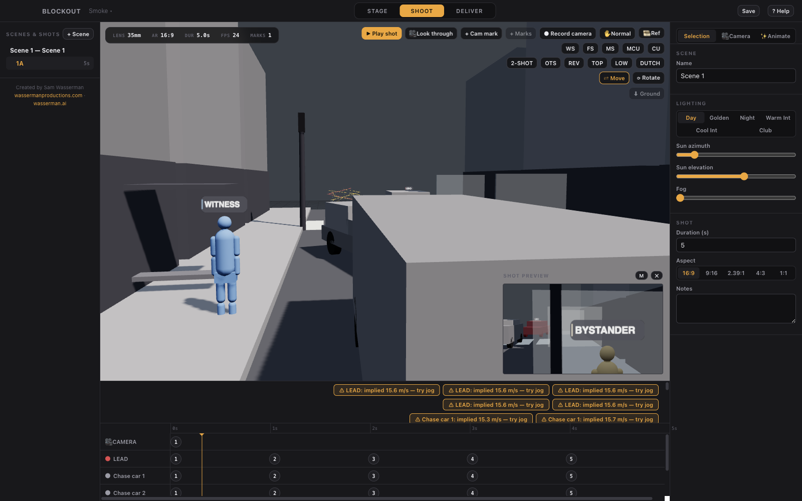
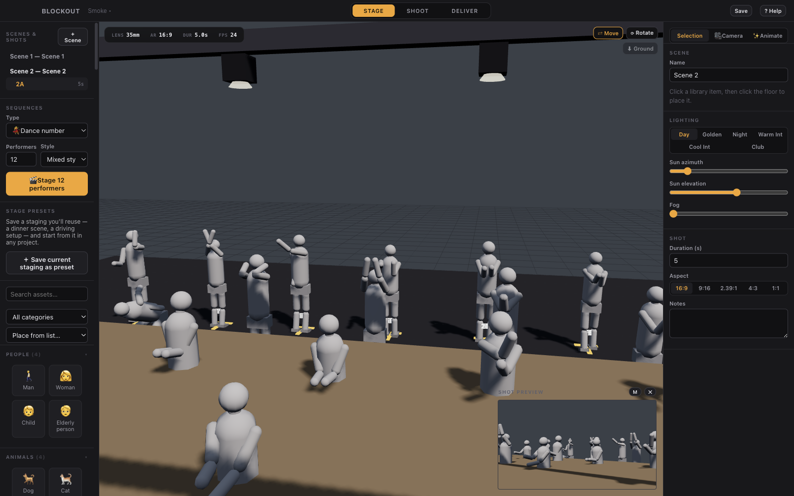
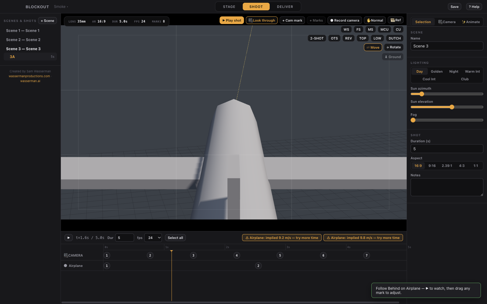
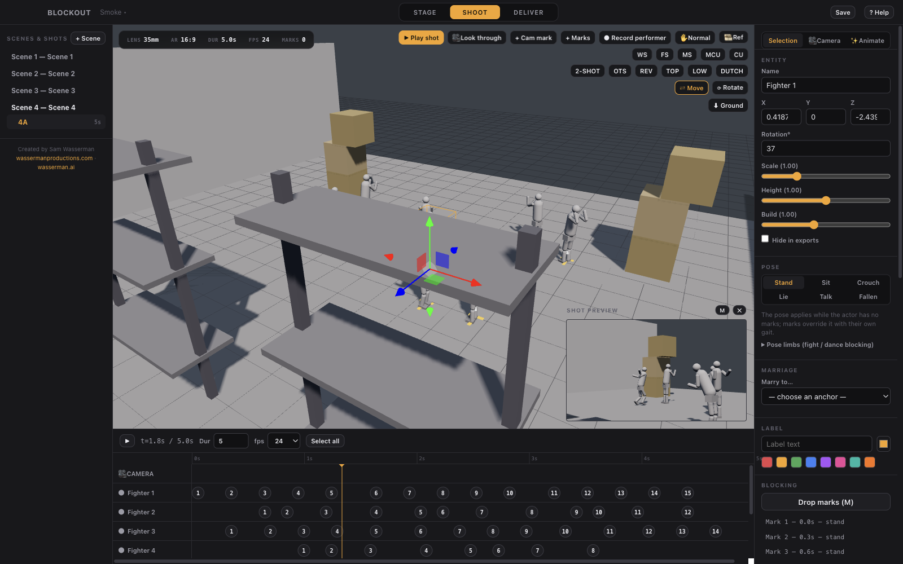
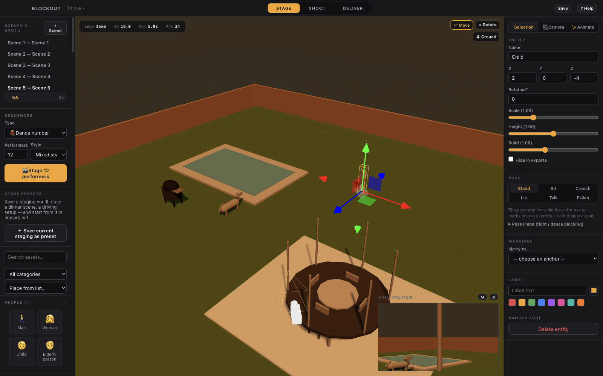
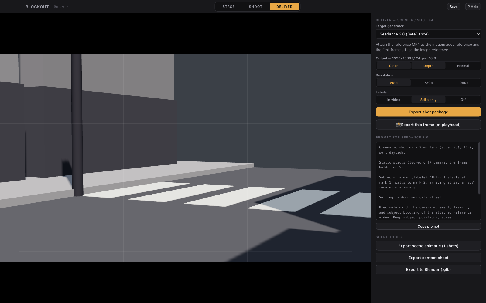

<div align="center">


**Previs for AI-native filmmaking.** Stage a scene, choreograph the camera and cast against marks — the way real sets work — and export a motion-reference package a video generator can't misread.



</div>

---

Video generators produce dramatically better results when you hand them an unambiguous motion reference: a rough 3D render showing exactly the camera move and character blocking you want. Blockout is the fastest path from *"I can see the shot"* to *"the generator can't get it wrong."* It exports video + depth pass + stills + a tailored prompt that **Seedance 2.0, Veo 3.1, Kling, LTX 2.3, and Wan 2.2** can follow precisely.

It is deliberately **not** a 3D art tool. Grey-box mannequins and vehicles at real-world scale, real lens math, and choreography tools are the whole product. The fidelity target is *unambiguous, not beautiful.*

- 🎬 **Real camera optics** — Super 16 / 35 / Full Frame / 65mm sensors, real focal lengths, keyframable zoom, rack focus, aspect masks.
- 🚶 **Marks-based choreography** — one mental model for camera and actors; editable paths, per-mark easing, gaits, and speed sanity warnings.
- 🎥 **Coverage model** — a scene owns the blocking; shots own cameras. Shoot the same action from five angles without re-blocking.
- 👥 **One-click crowds** — dance numbers, brawls, foot and car chases: pick a size and style, click the floor, and the whole choreographed cast stages exactly there. Restyle the entire group later in one click.
- ✨ **An Animate tab** — 64 character motions (fights, dances, sit/drink/jump, playing cards, squirt-gun) and 25 action paths (plane landings, helicopter orbits, car chases, collapsing debris) always one click away.
- 🎛️ **27 classic camera moves** — orbits, cranes, drone follows, vertigo dolly-zoom — built around your subject and riding along if it moves.
- 📦 **Deterministic exports** — the same project renders byte-identical frames on every run. Playback performance never touches the output.
- 🤖 **Agent-drivable** — a bundled MCP server lets Claude Code, Codex, or any MCP client stage and shoot the scene for you.

---

## The 60-second workflow

1. **STAGE** — drop in one of 50+ environment kits (downtown, residential street, supermarket, movie theater, train car, backyard with pool, sky for aerials…), place people / animals / vehicles / furniture / props from the library, and label your subjects ("THIEF", red).
2. **SHOOT** — select an actor, press `M`, click the floor to drop numbered marks; the actor walks them on your timeline. Frame the camera (or click **MS** to auto-frame a medium shot at your lens), drop camera marks, pick a rig — dolly, steadicam, handheld, crane, drone, car-mount. Scrub, retime, play.
3. **DELIVER** — pick your generator, click **Export shot package**:

```
Shot-1A/export-…/
├── 1A_reference.mp4      # the motion reference (deterministic render)
├── 1A_depth.mp4          # depth pass for ComfyUI control workflows
├── 1A_normal.mp4         # optional normal pass
├── stills/               # frame at every camera mark + first/last + top-down blocking diagram
├── prompt.txt            # generated from your actual blocking, tailored per generator
├── comfyui-workflow.json # pre-wired depth-conditioning workflow (Wan/LTX profiles)
├── metadata.json         # machine-readable marks/lenses/timings
└── README.txt
```

Plus per-scene tools: **animatic export** (all shots stitched), **contact sheet**, and **Blender handoff** (`.glb` with the animated camera + a one-click import script).

---

## Screenshot tour

|  |  |
|---|---|
|  |  |
| **Stage** — one click spawns a whole choreographed crowd. Twenty dancers, mixed styles, every performer individually editable. | **Shoot** — look through the shot camera as a *Follow Behind* drone move rides a climbing plane, aim-locked to the aircraft. |
|  |  |
| **Choreograph** — a paired brawl laid out as timeline lanes of mark pills; select a fighter to edit its path in the inspector. | **Light** — a backyard with pool, trampoline, grill, kid and dog, dressed in golden-hour light. Six lighting presets, one click each. |

### Deliver



Pick a target generator and Blockout writes the prompt from your *actual* blocking — lens, sensor, rig, and every subject's move — then bundles the reference video, depth pass, stills, and a pre-wired ComfyUI workflow.

---

## Feature tour

### Stage

Fifty-plus grey-box environment kits and a full library of people, animals, vehicles, furniture, and props — all at real-world scale, all procedurally generated in code. Label subjects with colored callouts, snap things to the ground, and save any staging as a reusable global **preset** (a dinner scene, a driving setup) to start from in any project.

### Shoot

Coverage the way a real set works: the **scene** owns the blocking, each **shot** owns a camera. Drop camera and actor marks on a shared timeline, choose a rig (dolly / steadicam / handheld / crane / drone / car-mount), and get **speed sanity warnings** when a walk implies 6 m/s. Auto-framing presets (two-shot, OTS, reverse, top, low, dutch) place the camera relative to your labelled subjects. Ghost an existing video — including depth maps — over the viewport as a timeline-synced **reference underlay** to match blocking by eye.

### Deliver

Data-driven **generator profiles** define durations, resolutions, reference modes, and prompt templates per model; adding a new generator is a config edit. Exports are **deterministic** — the timeline is stepped at exact fps and rendered offline, so the same project exports byte-identical frames on every run. Projects are a folder of pretty-printed, stable-key-order JSON: diff it, branch it, review it.

### Sequences & presets

Stage a whole choreographed crowd in one action — pick **Dance number / Fight / Foot chase / Car chase**, set the head-count (2–60) and style, then **click the floor exactly where you want them**: performers *and* their choreography appear there, facing the camera. A staged sequence is a *starting point*: shift-click the group (their choreography moves with them when you drag) and the **✨ Animate tab** swaps everyone's dance style or path in one click. Non-character performers get motion-path presets too: plane takeoff / landing / flyby, helicopter orbit, bird swoop, falling debris, thrown objects. For the camera, apply one of **27 classic moves** — orbits, cranes, drone follows, whip pans, the vertigo dolly-zoom — each built around your subject and riding along if it moves.

### Agent control

Blockout ships an **MCP server** so an AI agent can drive the running app — stage entities, choreograph marks, reframe, scrub, and grab a viewport screenshot — the same moves you'd make by hand. See **[mcp/README.md](mcp/README.md)** for the full agent-integration guide.

---

## Install

**Download** a release DMG (macOS) from GitHub Releases, or build from source:

```bash
git clone <this repo>
cd blockout
npm install
npm run dev                    # development, hot reload
# or
npm run build && npm start     # production build
```

Requirements: **Node 22+**, and **ffmpeg** for exports (bundled via `ffmpeg-static` when packaged; falls back to system `ffmpeg` — `brew install ffmpeg`).

The packaged DMG is unsigned. For your own machines, right-click → Open bypasses Gatekeeper. For wider distribution, set a Developer ID `identity` and notarization in [electron-builder.yml](electron-builder.yml).

---

## Agent control (MCP)

Point **Claude Code, Codex, Hermes, or any MCP client** at the bundled MCP server and it can stage the scene, choreograph marks, reframe the camera, scrub the timeline, and pull a viewport screenshot. Register it with Claude Code in one line:

```bash
claude mcp add blockout -- node /Users/eklpse1/Desktop/blockout/mcp/blockout-mcp.mjs
```

Discovery and auth are automatic — the app writes a localhost-only port + bearer token to `~/.config/blockout/control.json` on launch, and the zero-dependency bridge reads it. There are **26 tools** (from `get_state` and `add_entity` through `spawn_sequence`, `apply_camera_move`, and `screenshot`).

👉 **Full setup, the complete tool table, and a worked session: [mcp/README.md](mcp/README.md).**

---

## Scripts

| Command | What it does |
|---|---|
| `npm run dev` | Run with hot reload |
| `npm run typecheck` / `npm run lint` | Strict TS + ESLint |
| `npm test` | Engine unit tests (Vitest) |
| `npm run smoke` | Build + full end-to-end smoke: boots the app, stages a scene, exports a real package, verifies it with ffprobe, checks byte-determinism |
| `npm run package` | Build a macOS DMG (`release/`) |

## Project structure

See [docs/DESIGN.md](docs/DESIGN.md) (product + architecture), [docs/ROADMAP.md](docs/ROADMAP.md) (build plan + QA program), and [AGENTS.md](AGENTS.md) (how AI agents should build / run / modify this app). The deterministic core lives in `src/engine/` — pure TypeScript, no DOM, fully unit-tested; `state(t)` is a pure function shared by playback, video export, stills, and glTF baking.

## License & credits

**Apache License 2.0** — see [LICENSE](LICENSE). Free to use, modify, fork, and build on, commercially or otherwise.

**Attribution required:** per the [NOTICE](NOTICE) file (Apache 2.0 §4(d)), any use, fork, or redistribution must retain the NOTICE file and credit **Sam Wasserman ([wassermanproductions.com](https://wassermanproductions.com))** in its documentation and about/credits surface.

All 3D assets are procedurally generated in code — no external asset licenses involved.

Created by **Sam Wasserman** — [wassermanproductions.com](https://wassermanproductions.com) · [wasserman.ai](https://wasserman.ai).
